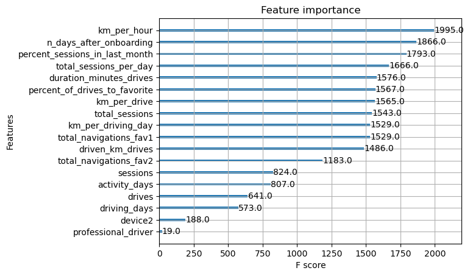

# Waze App

## Overview
Waze leadership want to build a machine learning model to predict user churn. The model is based on data collected from users of the Waze app.

## Business Understanding
Waze’s free navigation app makes it easier for drivers around the world to get to where they want to go. Waze’s community of map editors, beta testers, translators, partners, and users helps make each drive better and safer. Waze partners with cities, transportation authorities, broadcasters, businesses, and first responders to help as many people as possible travel more efficiently and safely. 

my task is to collaborate with Waze teammates to analyze and interpret data, generate valuable insights, and help leadership make informed business decisions. my team is about to start a new project to help prevent user churn on the Waze app. Churn quantifies the number of users who have uninstalled the Waze app or stopped using the app. This project focuses on monthly user churn. In my role, i will will analyze user data and develop a machine learning model that predicts user churn. 

This project is part of a larger effort at Waze to increase growth. Typically, high retention rates indicate satisfied users who repeatedly use the Waze app over time. Developing a churn prediction model will help prevent churn, improve user retention, and grow Waze’s business. An accurate model can also help identify specific factors that contribute to churn and answer questions such as: 

- Who are the users most likely to churn?

- Why do users churn? 

- When do users churn? 

## Data Understanding
- Dataset Overview:
    - The dataset is named "waze_dataset.csv" and is created synthetically for a project in partnership with Waze.
    It consists of 14,999 rows, where each row represents a unique user.
    - There are a total of 13 columns in the dataset, each containing specific information about the users and their interactions with the Waze app.

- Data Variables:

    - ID (Integer): This is a sequential numbered index, likely used for identification purposes.

    - label (Object): This is the target variable, representing whether a user has "retained" (remained active) or "churned" (ceased using the app) during the course of the month. It is a binary classification variable.

    - sessions (Integer): This variable counts the number of times a user opens the Waze app during the month.

    - drives (Integer): This represents the number of times a user has driven at least 1 kilometer using the Waze app during the month.

    - device (Object): This categorical variable indicates the type of device a user starts a session with. It could include different types of mobile devices or platforms.

    - total_sessions (Float): This is a model estimate of the total number of sessions since a user onboarded. It is a floating-point number, possibly indicating an estimate with decimal precision.

    - n_days_after_onboarding (Integer): This variable represents the number of days since a user signed up for the Waze app. It provides a time-related metric.

    - total_navigations_fav1 (Integer): The total number of navigations a user has made to their favorite place 1 since onboarding.

    - total_navigations_fav2 (Integer): Similar to the previous variable, this one represents the total number of navigations to the user's favorite place 2 since onboarding.

    - driven_km_drives (Float): Total kilometers driven by the user during the month, measured in kilometers and with decimal precision.

    - duration_minutes_drives (Float): Total duration of driving in minutes during the month, measured in minutes with decimal precision.

    - activity_days (Integer): The number of days the user opens the Waze app during the month, which provides insights into user engagement.

    - driving_days (Integer): The number of days the user actually drives (covering at least 1 kilometer) during the month, indicating the frequency of active use.

- Data Types:
The dataset contains a mix of data types, including integers (e.g., ID, sessions), objects (e.g., label, device), and floating-point numbers (e.g., total_sessions, driven_km_drives).

- Data Size:
The dataset consists of a substantial number of rows (14,999) and columns (13), making it suitable for various analyses and modeling tasks.

- Objective:
The primary objective of this dataset appears to be predicting user retention or churn based on user behavior and characteristics.

## Modeling and Evaluation

Engineered features accounted for six of the top 10 features: km_per_hour, percent_sessions_in_last_month, total_sessions_per_day, percent_of_drives_to_favorite, km_per_drive, km_per_driving_day.

The XGBoost model fit the data better than the random forest model. Additionally, it’s important to call out that the recall score (17%) is nearly double the score from the previous logistic regression model built in Milestone 5, while still maintaining a similar accuracy and precision score. 

The ensembles of tree-based models in this project milestone are more valuable than a singular logistic regression model because they achieve higher scores across all evaluation metrics and require less preprocessing of the data. However, it is more difficult to understand how they make their predictions.

## Conclusion
In conclusion, this project represents a significant step forward for Waze in its ongoing efforts to enhance user retention and growth. By developing a machine learning model to predict user churn, we have equipped Waze with a powerful tool to better understand, anticipate, and ultimately reduce churn among its user base.

Our analysis revealed critical insights into the factors influencing user churn. Engineered features such as km_per_hour, percent_sessions_in_last_month, total_sessions_per_day, percent_of_drives_to_favorite, km_per_drive, and km_per_driving_day emerged as essential contributors to our predictive model's accuracy. This demonstrates the value of feature engineering in capturing meaningful patterns within the data.

Furthermore, our choice of the XGBoost model over the random forest model proved to be a wise decision, as it outperformed the previous logistic regression model significantly. Notably, the recall score improved substantially, highlighting our model's ability to identify users at risk of churn.

The use of ensemble tree-based models offers a robust and effective approach to churn prediction, achieving higher scores across all evaluation metrics without requiring extensive data preprocessing. However, it's important to acknowledge the inherent complexity in interpreting the decision-making process of these models.

This project aligns with Waze's overarching goal of enhancing user satisfaction, improving retention rates, and ultimately growing the business. By leveraging the insights gained from this machine learning model, Waze is well-positioned to implement targeted strategies to retain users and provide them with an even more valuable navigation experience. As we move forward, ongoing monitoring and refinement of the model will be crucial to ensure its continued effectiveness in reducing user churn and contributing to Waze's continued success.